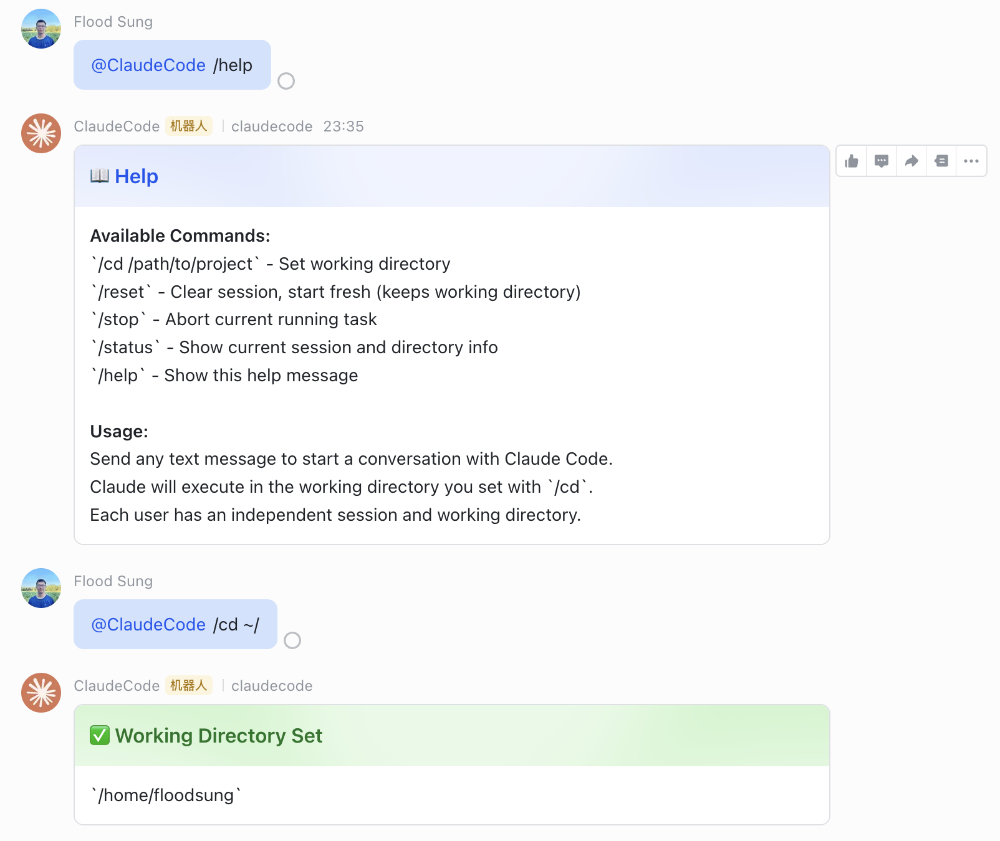
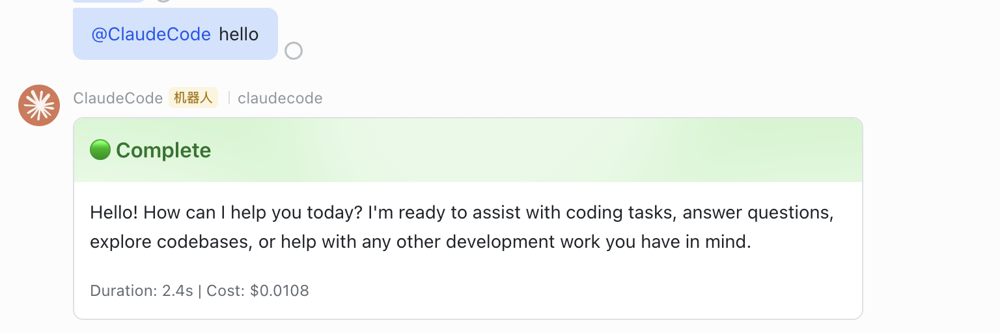

# feishu-claudecode

[English](#english) | [中文](#中文)

<p align="center">
  
  
</p>

---

<a id="english"></a>

## English

A bridge service connecting Feishu (Lark) Bot to Claude Code CLI. Chat with Claude Code from Feishu on any device (including mobile), with real-time streaming updates via interactive cards.

### Features

- **Remote access** - Use Claude Code from any Feishu device, including mobile
- **Streaming updates** - Real-time execution progress via interactive card updates
- **Multi-user parallel** - Independent sessions and working directories per user
- **Multi-turn conversations** - Automatic context persistence across messages
- **Image support** - Send images to Claude for analysis; Claude-generated images are sent back
- **MCP integration** - Automatically loads MCP server configs from Claude Code settings
- **Status cards** - Color-coded status, tool call tracking, cost/duration stats

### Prerequisites

- **Node.js 18+**
- **Claude Code authentication** - Either logged in via `claude login` (subscription) or `ANTHROPIC_API_KEY` env var
- **Feishu Open Platform account** - To create a bot application

### Feishu Bot Setup

1. Go to [Feishu Open Platform](https://open.feishu.cn/) and create an enterprise app
2. Go to **App Capabilities** → Add **Bot**
3. Go to **Events & Callbacks** → **Event Configuration**:
   - Select **"Use persistent connection to receive events"** (WebSocket mode, no public IP needed)
   - Add event: `im.message.receive_v1`
4. Go to **Permissions** and enable:
   - `im:message` - Send and receive messages
   - `im:message:readonly` - Read messages
5. Publish the app version and get approval

### Installation

```bash
git clone <your-repo-url>
cd feishu-claudecode
npm install
```

### Configuration

```bash
cp .env.example .env
```

Edit `.env`:

| Variable | Required | Default | Description |
|----------|----------|---------|-------------|
| `FEISHU_APP_ID` | Yes | - | Feishu App ID |
| `FEISHU_APP_SECRET` | Yes | - | Feishu App Secret |
| `AUTHORIZED_USER_IDS` | No | (allow all) | Comma-separated user open_ids |
| `AUTHORIZED_CHAT_IDS` | No | (allow all) | Comma-separated chat_ids |
| `CLAUDE_DEFAULT_WORKING_DIRECTORY` | No | - | Default working directory |
| `CLAUDE_ALLOWED_TOOLS` | No | Read,Edit,Write,Glob,Grep,Bash,WebSearch,WebFetch | Allowed tools |
| `CLAUDE_MAX_TURNS` | No | 50 | Max conversation turns per query |
| `CLAUDE_MAX_BUDGET_USD` | No | 1.0 | Max cost per query (USD) |
| `CLAUDE_MODEL` | No | SDK default | Claude model |
| `LOG_LEVEL` | No | info | Log level |

### Usage

```bash
# Development
npm run dev

# Production
npm run build && npm start
```

### Commands

| Command | Description |
|---------|-------------|
| `/cd /path/to/project` | Set working directory (required before first use) |
| `/reset` | Clear session, start fresh (keeps working directory) |
| `/stop` | Abort current running task |
| `/status` | Show current session info |
| `/help` | Show help message |

### Image Support

**Send images to Claude:** Send an image in Feishu chat, and Claude will analyze it.

**Receive images from Claude:** When Claude generates or writes image files (via Write tool, Bash, or MCP tools), they are automatically uploaded and sent back to Feishu.

Supported formats: PNG, JPEG, GIF, WEBP, BMP, SVG, TIFF (max 10MB per Feishu limit).

### MCP Server Configuration

MCP servers are loaded from Claude Code's standard config files — no extra setup needed:

- **Global (all projects):** `~/.claude/settings.json`
- **Per-project:** `<working-directory>/.claude/settings.json`

Example config:

```json
{
  "mcpServers": {
    "my-server": {
      "command": "npx",
      "args": ["-y", "my-mcp-server"],
      "env": { "API_KEY": "..." }
    }
  }
}
```

The bot loads MCP servers based on the working directory set via `/cd`. If you already have MCP servers configured for Claude Code CLI, they work automatically.

### Security Note

This service runs Claude Code in **`bypassPermissions` mode** — Claude can read, write, and execute commands without interactive approval, since there is no terminal for user confirmation in a chat bot context.

**Make sure you understand the implications before deploying:**

- Claude has full read/write access to the working directory
- Claude can execute arbitrary shell commands if `Bash` is in the allowed tools
- Use `CLAUDE_ALLOWED_TOOLS` to restrict capabilities (e.g. remove `Bash` for read-only use)
- Use `CLAUDE_MAX_BUDGET_USD` to cap per-request cost
- Use `AUTHORIZED_USER_IDS` to restrict who can access the bot
- **Never point the bot at directories containing sensitive data without proper access controls**

### Architecture

```
Feishu User
  → [WSClient] receives message event
  → [Event Handler] auth check, extract text, strip @mentions
  → [Message Bridge] orchestrates:
      1. Send "thinking" card
      2. Call Claude Code Agent SDK
      3. Stream process → throttled card updates (1.5s interval)
      4. Final result card
  → User sees real-time progress and results in Feishu
```

---

<a id="中文"></a>

## 中文

飞书 Bot 连接 Claude Code 的桥接服务。在飞书（包括手机端）通过聊天远程控制本机的 Claude Code，实时查看执行过程和结果。

### 功能特性

- **远程访问** - 在飞书任意设备上使用 Claude Code，手机也能写代码
- **流式更新** - 通过飞书交互卡片实时展示执行进度
- **多用户并行** - 每个用户独立会话和工作目录，互不干扰
- **多轮对话** - 自动维护对话上下文，支持连续交互
- **图片支持** - 发图片给 Claude 分析；Claude 生成的图片自动回传飞书
- **MCP 集成** - 自动加载 Claude Code 配置文件中的 MCP 服务器
- **状态卡片** - 颜色标识状态、工具调用追踪、费用/耗时统计

### 前置条件

- **Node.js 18+**
- **Claude Code 认证** - 通过 `claude login` 登录（订阅用户），或设置 `ANTHROPIC_API_KEY` 环境变量
- **飞书开放平台账号** - 用于创建机器人应用

---

### 第一步：创建飞书机器人

#### 1.1 创建应用

1. 打开 [飞书开放平台](https://open.feishu.cn/)，登录后点击「创建企业自建应用」
2. 填写应用名称（如 `Claude Code Bot`）和描述，点击创建

#### 1.2 获取凭证

1. 进入应用详情页，左侧菜单找到「凭证与基础信息」
2. 记录 **App ID** 和 **App Secret**，后面配置要用

#### 1.3 开启机器人能力

1. 左侧菜单 →「应用能力」→「添加应用能力」
2. 选择「机器人」，点击添加

#### 1.4 配置事件订阅

1. 左侧菜单 →「事件与回调」→「事件配置」
2. **订阅方式选择「使用长连接接收事件」**（这样不需要公网 IP，本地即可运行）
3. 添加事件：搜索并添加 `接收消息 im.message.receive_v1`

#### 1.5 配置权限

1. 左侧菜单 →「权限管理」
2. 搜索并开通以下权限：
   - `im:message` - 获取与发送单聊、群组消息
   - `im:message:readonly` - 读取消息（如已有 `im:message` 可跳过）

#### 1.6 发布应用

1. 左侧菜单 →「版本管理与发布」
2. 创建版本并提交审核
3. 管理员在飞书管理后台审核通过后即可使用

> **提示**：如果是个人测试，可以在「应用发布」中选择仅对自己可见的测试范围。

---

### 第二步：安装项目

```bash
git clone <your-repo-url>
cd feishu-claudecode
npm install
```

---

### 第三步：配置环境变量

```bash
cp .env.example .env
```

编辑 `.env` 文件：

```bash
# ===== 必填 =====

# 飞书应用凭证（第一步获取的）
FEISHU_APP_ID=cli_xxxxxxxxxx
FEISHU_APP_SECRET=xxxxxxxxxxxxxxxxxx

# ===== 选填 =====

# 访问控制（逗号分隔，留空表示不限制）
AUTHORIZED_USER_IDS=
AUTHORIZED_CHAT_IDS=

# Claude Code 默认工作目录（留空则需要用户先用 /cd 指定）
CLAUDE_DEFAULT_WORKING_DIRECTORY=

# Claude 可用的工具
CLAUDE_ALLOWED_TOOLS=Read,Edit,Write,Glob,Grep,Bash,WebSearch,WebFetch

# 每次请求的最大对话轮数
CLAUDE_MAX_TURNS=50

# 每次请求的最大花费（美元）
CLAUDE_MAX_BUDGET_USD=1.0

# 指定模型（留空使用 SDK 默认模型）
CLAUDE_MODEL=

# 日志级别
LOG_LEVEL=info
```

#### 关于 Claude Code 认证

有两种方式，任选其一：

**方式一：订阅用户（推荐）**

如果你有 Claude Pro/Max 订阅，直接登录即可：

```bash
claude login
```

**方式二：API Key**

设置 `ANTHROPIC_API_KEY` 环境变量：

```bash
# 加到你的 ~/.bashrc 或 ~/.zshrc 中
export ANTHROPIC_API_KEY=sk-ant-xxxxxxxxxx
```

---

### 第四步：启动服务

#### 开发模式（推荐先用这个测试）

```bash
npm run dev
```

#### 生产模式

```bash
npm run build
npm start
```

看到类似以下日志表示启动成功：

```
[INFO] Starting feishu-claudecode bridge...
[INFO] feishu-claudecode bridge is running
```

---

### 第五步：开始使用

#### 基本流程

1. 在飞书中找到你的机器人（私聊或拉入群组）
2. 发送 `/cd /path/to/your/project` 设置工作目录
3. 发送任意消息开始和 Claude Code 对话
4. 卡片会实时更新执行进度，完成后显示最终结果

#### 可用命令

| 命令 | 说明 |
|------|------|
| `/cd /path/to/project` | 设置工作目录（首次使用必须先设置） |
| `/reset` | 清除对话历史，重新开始（保留工作目录设置） |
| `/stop` | 中止当前正在执行的任务 |
| `/status` | 查看当前会话状态和工作目录 |
| `/help` | 显示帮助信息 |

#### 使用示例

```
你：/cd /Users/me/my-project
Bot：✅ Working Directory Set - /Users/me/my-project

你：帮我看看这个项目的结构，有哪些主要模块
Bot：🔵 Thinking... → 🔵 Running... → 🟢 Complete
    （卡片实时更新，展示 Claude 正在读取哪些文件、分析结果等）

你：给 utils.ts 加上单元测试
Bot：（Claude 会读取文件、编写测试、运行测试，全程卡片更新）

你：/reset
Bot：✅ Session Reset - 开始新对话
```

---

### 卡片状态说明

| 颜色 | 状态 | 含义 |
|------|------|------|
| 🔵 蓝色 | Thinking | Claude 正在思考 |
| 🔵 蓝色 | Running | 正在执行工具（读文件、写代码、运行命令等） |
| 🟢 绿色 | Complete | 执行完成 |
| 🔴 红色 | Error | 执行出错 |

卡片底部会显示：耗时、API 花费等统计信息。

---

### 多用户说明

- 会话按**用户**（open_id）隔离，不同用户互不影响
- 同一用户在私聊和群组中共享同一个会话
- 每个用户可以通过 `/cd` 设置自己的工作目录
- 用户 A 在执行任务时，用户 B 可以同时发起新任务

---

### 图片支持

**发送图片给 Claude：** 在飞书中直接发送图片，Claude 会自动分析图片内容。

**接收 Claude 生成的图片：** 当 Claude 通过工具（Write、Bash、MCP 等）生成图片文件时，图片会自动上传并发送到飞书聊天中。

支持格式：PNG、JPEG、GIF、WEBP、BMP、SVG、TIFF（单张最大 10MB，飞书限制）。

---

### MCP 服务器配置

MCP 服务器配置直接复用 Claude Code 的标准配置文件，无需额外设置：

- **全局配置（所有项目共用）：** `~/.claude/settings.json`
- **项目配置（特定目录生效）：** `<工作目录>/.claude/settings.json`

配置示例：

```json
{
  "mcpServers": {
    "my-server": {
      "command": "npx",
      "args": ["-y", "my-mcp-server"],
      "env": { "API_KEY": "..." }
    }
  }
}
```

Bot 会根据 `/cd` 设置的工作目录加载对应的 MCP 配置。如果你已经为 Claude Code CLI 配置过 MCP 服务器，它们会自动生效。

---

### 架构概览

```
飞书用户发消息
  → [WSClient 长连接] 接收消息事件
  → [Event Handler] 鉴权、提取文本、去除 @
  → [Message Bridge] 编排核心流程：
      1. 发送"思考中"卡片
      2. 调用 Claude Code Agent SDK
      3. 流式处理 → 节流更新卡片（1.5s 间隔）
      4. 完成后更新为最终结果卡片
  → 用户在飞书看到实时过程和结果
```

---

### 安全说明

本服务以 **`bypassPermissions`（跳过权限确认）模式** 运行 Claude Code —— Claude 可以直接读写文件和执行命令，无需交互式确认（因为聊天机器人场景下没有终端来审批）。

**部署前请确保你了解以下影响：**

- Claude 对工作目录拥有完整的读写权限
- 如果允许工具列表中包含 `Bash`，Claude 可以执行任意 Shell 命令
- 通过 `CLAUDE_ALLOWED_TOOLS` 限制可用工具（例如去掉 `Bash` 实现只读模式）
- 通过 `CLAUDE_MAX_BUDGET_USD` 限制单次请求的最大花费
- 通过 `AUTHORIZED_USER_IDS` 限制谁可以使用机器人
- **不要将机器人指向包含敏感数据的目录，除非已做好访问控制**

---

### 常见问题

**Q: 需要公网 IP 吗？**

不需要。本项目使用飞书的 **WebSocket 长连接**模式接收事件，只需要能访问外网即可，无需域名或公网 IP。

**Q: 为什么消息没有响应？**

检查以下几点：
1. 应用是否已发布并审核通过
2. 事件订阅是否选择了「长连接」模式
3. 是否添加了 `im.message.receive_v1` 事件
4. 权限 `im:message` 是否已开通
5. 如果配置了 `AUTHORIZED_USER_IDS`，确认你的 open_id 在列表中

**Q: 如何获取用户的 open_id？**

发送 `/status` 命令，卡片中会显示当前用户的 open_id。

**Q: 如何限制只有特定人可以使用？**

在 `.env` 中设置 `AUTHORIZED_USER_IDS`，多个 ID 用逗号分隔：

```bash
AUTHORIZED_USER_IDS=ou_xxxx1,ou_xxxx2
```

**Q: Claude 执行超时了怎么办？**

默认 10 分钟超时。如果任务确实需要更长时间，可以拆分为多个小任务。也可以用 `/stop` 手动中止后重试。

---

## License

[MIT](LICENSE)
